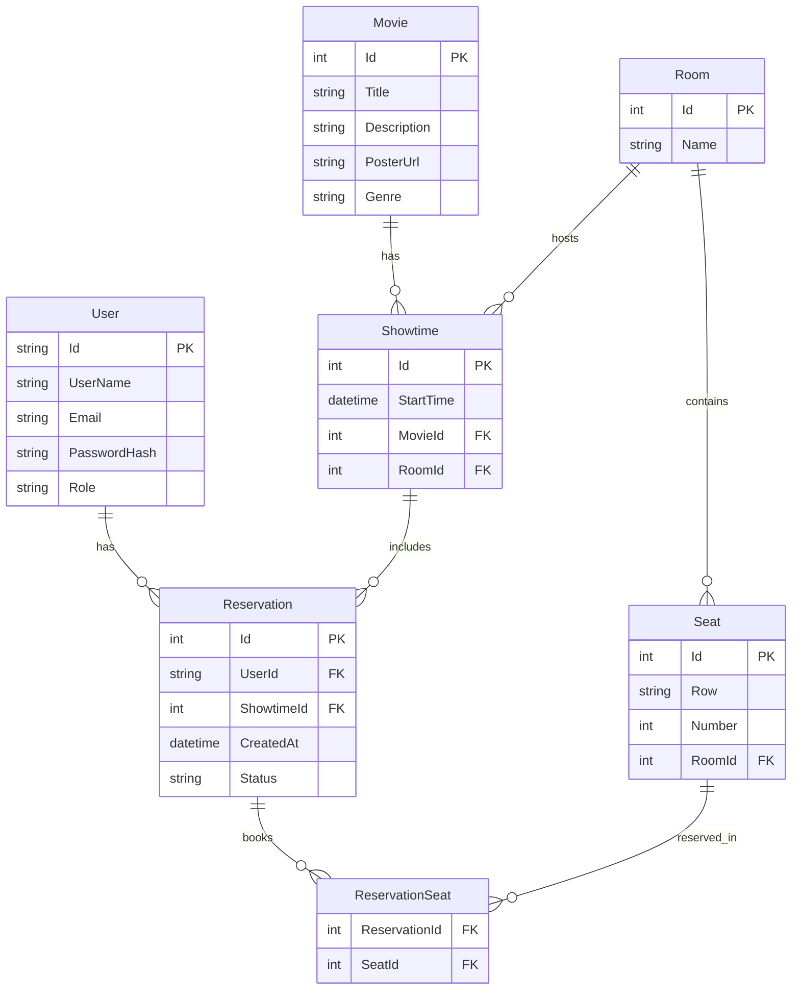

# Diagrama Entidad-Relación (ER)

---

- **Notas:**
  - `ReservationSeat` es una tabla de unión para la relación N:M entre Reservation y Seat.
  - `Room` permite modelar múltiples salas y asientos por sala.
  - `Role` en User puede ser Admin o User. 